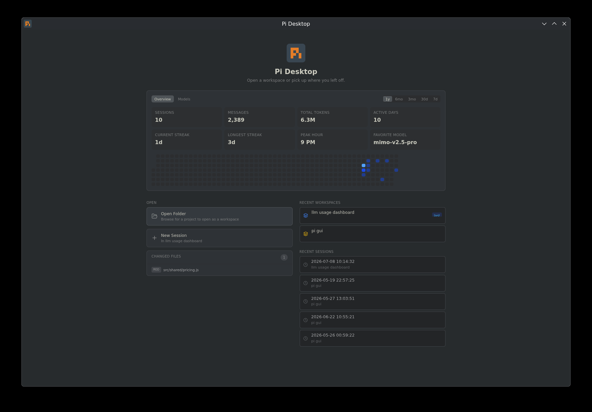

# Pi Desktop

A desktop GUI for the [Pi coding agent](https://pi.dev). Chat, manage projects, browse files, run commands, install packages — all in one window.



Still in alpha — expect rough edges.

## What it does

- Streaming chat with thinking blocks, tool use, and rich rendering — bundled fonts + color emoji, inline SVG preview, collapsible tool-call results, clickable file links that open a preview pane
- Home dashboard with usage stats — messages, tokens, active-day streaks, peak hour, per-model breakdown
- [Multi-Agent Council Planning](#multi-agent-council-planning) — Pi, Claude, and Codex plan together and reach consensus before Pi builds (opt-in)
- Command palette (`Ctrl/Cmd+K` or `/`) — run skills, prompt templates, and built-in commands
- Skills browser, session fork/branch tree, and one-click context compaction
- Session naming (read from Pi) with inline rename, and a themed in-app confirmation for delete
- Custom models & providers editor (Settings) — edits `~/.pi/agent/models.json`
- Multiple workspaces, each with its own Pi process and sessions
- Review rail (toggleable) with permissions, approvals, changed files, and session status
- File tree, code/image/HTML preview panes, code editor (CodeMirror 6 with syntax highlighting), diff viewer, file search
- Terminal with ANSI colors
- Package browser connected to pi.dev/packages, with instant local search
- Session tags, model switching, live-preview settings, themes (Dark, Light, System, Nord, Gruvbox, Breeze Dark, Breeze Light, Breeze Claudius)

## Review rail

The right-side Review rail keeps safety and working-tree state visible while you chat with Pi. Toggle it from the chat toolbar (hidden by default, so it doesn't compete for space with file/image previews).

Changed files use readable status badges:

| Badge | Meaning |
|-------|---------|
| `NEW` | Untracked new file |
| `MOD` | Existing tracked file was modified |
| `DEL` | Tracked file was deleted |
| `ADD` | New file staged in git |
| `STG` | Modified file staged in git |
| `REN` | File was renamed |

## Multi-Agent Council Planning

Pi, Claude, and Codex each produce an initial plan, share and converge, and Pi presents the agreed consensus plan *before* anything is built. All members plan read-only; Pi is the only agent that edits files.

This is **off by default**. Enable it in **Settings → "Multi-Agent Council Planning"**. A confirmation dialog warns that it increases token/credit usage, because each request runs multiple agents.

**Members.** Pi, Claude, and Codex. The app auto-detects each CLI cross-platform; only detected agents can be enabled, via per-agent checkboxes. At least two members must be available, or a run is refused. Pi always merges the plans into the final consensus, even when not checked as a planner.

**Read-only planning.** Every member plans read-only (Claude `--permission-mode plan`, Codex `--sandbox read-only`, Pi with write tools excluded) — they produce plans but never modify files. Only Pi implements the approved result.

**Live output.** Each member streams its plan live in its own card during the consulting phase, with an elapsed timer.

**Consensus modes:**

- **One debate round** (default) — each member sees the others' plans and revises once, then Pi merges. You watch them converge.
- **Arbiter merge** — faster/cheaper. Pi synthesizes the initial plans directly with no debate round.

**Per-member timeout** (10–600s, default 240s) bounds each member. A member that times out or errors is dropped, and the run proceeds as long as at least one plan was produced.

**To use it:** with the feature enabled, type your request and click **Plan with Council** in the composer. Review each member's plan and Pi's merged consensus plan. If you want changes, type feedback in **Request changes to the plan…** and Pi revises the consensus (repeat as needed). When you're happy, click **Implement this** to have Pi build it. The panel collapses once a plan is ready so the output stays readable.

## Getting started

You need Pi installed first:

```bash
npm install -g @earendil-works/pi-coding-agent
```

On Linux, grab the AppImage from [Releases](https://github.com/FaqFirebase/pi-desktop/releases):

```bash
chmod +x Pi-Desktop-linux-x64.AppImage
./Pi-Desktop-linux-x64.AppImage
```

### macOS

Download the `.dmg` (Apple Silicon / arm64) from [Releases](https://github.com/FaqFirebase/pi-desktop/releases), open it, and drag **Pi Desktop** to Applications.

Builds are **not yet signed or notarized**, so on first launch macOS blocks the app ("Apple could not verify… is free of malware"). To allow it:

1. Try to open **Pi Desktop** once (double-click). macOS blocks it — click **Done**.
2. Open **System Settings → Privacy & Security**.
3. Scroll down to the **Security** section. You'll see *"Pi Desktop was blocked to protect your Mac."* Click **Open Anyway**.
4. Confirm with Touch ID / your password, then open the app again.

You only need to do this once. If a downloaded `.zip` instead reports the app is **"damaged and can't be opened,"** that's the quarantine flag — clear it in Terminal:

```bash
xattr -dr com.apple.quarantine "/Applications/Pi Desktop.app"
```

> **Prefer to skip the unsigned-app warnings entirely?** Build from source. A build you compile yourself runs locally without Gatekeeper blocking it, so there's no signing/notarization prompt and no quarantine flag to clear. See [Build it yourself → Linux / macOS](#linux--macos) below.

### Windows

Download from [Releases](https://github.com/FaqFirebase/pi-desktop/releases): the **installer** (`…-win-x64-setup.exe`, recommended) or the **portable** `…-win-x64.exe`. Builds are unsigned, so SmartScreen may warn — choose **More info → Run anyway**. If file edits or saves fail, see the [Controlled Folder Access](#controlled-folder-access-ransomware-protection) note below. Windows is community-tested; please [open a bug report](https://github.com/FaqFirebase/pi-desktop/issues) if you hit an issue.

## Keyboard shortcuts

| Shortcut | What it does |
|----------|-------------|
| `Enter` | Send message |
| `Shift+Enter` | New line |
| `Escape` | Stop streaming |
| `Ctrl/Cmd+K` | Open command palette |
| `/` (start of message) | Open command palette |
| `Ctrl+P` | Cycle model |
| `Ctrl+Shift+F` | File search |
| `Ctrl+Shift+P` | Insert saved note |
| `Ctrl+N` | New session |
| `Ctrl+Shift+N` | New workspace |
| `Ctrl+O` | Open project |

## Build it yourself

### Linux / macOS

```bash
git clone https://github.com/FaqFirebase/pi-desktop.git
cd pi-desktop
npm install
npm run dev
```

### Windows

Windows requires extra steps because **node-pty** (the terminal backend) compiles a native module against Electron's ABI.

#### 1. Install prerequisites

Install all of the following **before** cloning:

- [Git for Windows](https://git-scm.com/download/win)
- [Node.js LTS](https://nodejs.org) — use the official Windows installer (adds `node` and `npm` to PATH)
- **Visual Studio Build Tools 2022** — download from [Visual Studio downloads](https://visualstudio.microsoft.com/downloads/#build-tools-for-visual-studio-2022)
  - Select the **Desktop development with C++** workload
  - Open **Individual components**, search `Spectre`, and install **Spectre-mitigated libs for v143 toolset**

> **⚠️ Use VS Build Tools 2022, not 2026.** node-pty requires Spectre-mitigated runtime libraries. VS 2022 stable (v143 toolset) ships them. VS 2026 preview (v180 toolset) does not — `npm install` will fail with `MSB8040: Spectre-mitigated libraries are required for this project`.

#### 2. Add a Windows Defender exclusion (recommended)

Defender can block or slow `npm install` on projects with many small files. Before cloning, add an exclusion:

Settings → Privacy & Security → Windows Security → Virus & threat protection → Manage settings → Exclusions → Add a folder → (pick where you'll clone the repo)

#### 3. Clone and install

```powershell
git clone https://github.com/FaqFirebase/pi-desktop.git
cd pi-desktop
npm install
```

The postinstall script rebuilds `node-pty` against Electron's ABI and downloads the Electron binary. First install may take a few minutes.

If the Electron binary is missing after install, use the [manual Electron binary download](#manual-electron-binary-download) steps below. This is the confirmed fallback on Windows when Electron's postinstall extraction leaves a partial `dist` folder.

#### 4. Install Pi

```powershell
powershell -c "irm https://pi.dev/install.ps1 | iex"
```

Open a **new terminal** after this so the updated PATH takes effect.

#### 5. Run

```powershell
npm run dev
```

#### Common Windows errors

| Error | Cause | Fix |
|-------|-------|-----|
| `MSB8040` — Spectre libs missing | VS Build Tools 2026 (v180 toolset) installed instead of 2022 (v143) | Uninstall 2026, install VS Build Tools 2022 with Spectre libs for v143 |
| `electron-vite is not recognized` | `npm install` didn't complete | Run `npm install` again |
| Electron binary missing after install | Electron's postinstall extraction left a partial or missing `dist` folder | Add the repo folder to Defender exclusions, then `npm install` again. If it still fails, use the manual download steps below |
| `EPERM` / `EACCES` writing a project file | Controlled Folder Access (Ransomware protection) is blocking writes under Documents/Desktop | Keep the repo and your projects out of protected folders, or allow Pi Desktop through Controlled folder access — see below |
| Pi shows "error" in status popover | Pi not installed or PATH not updated | Run the install script above in a **new** terminal window |

#### Controlled Folder Access (Ransomware protection)

Windows **Controlled Folder Access** protects `Documents`, `Desktop`, `Pictures`, and similar folders, silently blocking apps it doesn't trust from writing to them. Because Pi Desktop is a coding agent that edits files, this shows up as intermittent `EPERM`/`EACCES` failures — during `npm install`, when the agent edits code, or when you save a file — if your repo or projects live inside a protected folder.

The reliable fix is to **keep code out of protected folders**. Clone the repo and put your projects somewhere unprotected, for example:

```powershell
# Not C:\Users\<you>\Documents\... — use an unprotected path:
git clone https://github.com/FaqFirebase/pi-desktop.git C:\dev\pi-desktop
```

If you must keep code under Documents/Desktop, allow the app instead:

**Windows Security → Virus & threat protection → Ransomware protection → Manage ransomware protection → Allow an app through Controlled folder access → Add an allowed app** — add the installed `Pi Desktop.exe` (and, for development, `node.exe`, `git.exe`, and `electron.exe`).

> The portable `.exe` re-extracts to a temporary folder on each launch, so allow-listing it doesn't stick. Prefer the **installer** (`Pi-Desktop-<version>-win-x64-setup.exe`) if you rely on the allow-list approach.

#### Manual Electron binary download

If `npm install` completes but the app won't launch because Electron is missing or corrupted, download it directly from GitHub and unpack it into place. This is the known-good fallback when `node_modules\electron\dist` contains only partial contents, such as `locales`, and no `electron.exe`.

Replace `39.8.10` with the version in `node_modules/electron/package.json` if it differs.

```powershell
$ver = "43.0.0"
$url = "https://github.com/electron/electron/releases/download/v$ver/electron-v$ver-win32-x64.zip"
$zip = "$env:TEMP\electron-v$ver-win32-x64.zip"
Invoke-WebRequest -Uri $url -OutFile $zip
if (Test-Path node_modules\electron\dist) { Remove-Item -Recurse -Force node_modules\electron\dist }
Expand-Archive -Path $zip -DestinationPath node_modules\electron\dist -Force
"electron.exe" | Out-File -Encoding ASCII -NoNewline node_modules\electron\path.txt
"v$ver" | Out-File -Encoding ASCII -NoNewline node_modules\electron\dist\version
```

After this, `npm run dev` should work normally.

> **Note:** Windows builds are community-tested. If you hit an issue not listed above, please [open a bug report](https://github.com/FaqFirebase/pi-desktop/issues).

## License

Apache 2.0

## Links

- [pi-desktop.com](https://pi-desktop.com)
- [pi.dev](https://pi.dev)
- [Packages](https://pi.dev/packages)
- [Issues](https://github.com/FaqFirebase/pi-desktop/issues)
